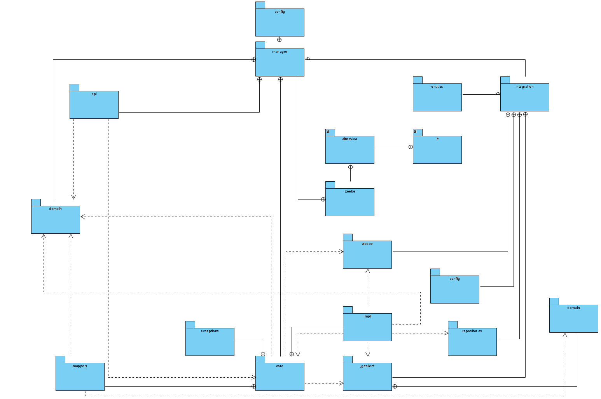

Zeebe Manager Backend
==========================

An application for [Zeebe](https://zeebe.io). It is designed to

* deploy a workflow on Zeebe Broker
* get Zeebe cluster topology information
* versioning BPMN diagrams on local Git Repository

## Component diagram


## Package diagram


## Install
### Docker
The docker image for the worker is published to [Nexus Giottolabs](https://repo.eai.giottolabs.com)

```
docker pull docker.eai.giottolabs.com/zeebe-manager-be:0.26.0
docker run -d --name zeebemanagerbe -p 8181:8181 docker.eai.giottolabs.com/zeebe-manager-be:0.26.0
```


* ensure that a Zeebe broker is running
* configure the connection to the Zeebe broker by setting `zeebe.client.broker.contactPoint` (default: `localhost:26500`) 


### Configuration

The application is a Spring Boot application that uses the [Spring Zeebe Starter](https://github.com/zeebe-io/spring-zeebe). The configuration can be changed via environment variables or an `application.yaml` file. See also the following resources:
* [Spring Zeebe Configuration](https://github.com/zeebe-io/spring-zeebe#configuring-zeebe-connection)
* [Spring Boot Configuration](https://docs.spring.io/spring-boot/docs/current/reference/html/spring-boot-features.html#boot-features-external-config)

By default, the port is set to `8181` and the datasource is **postgres**.

```
spring:
  profiles:
    active: development
  jpa:
    show-sql: true
    hibernate:
      naming_strategy: org.hibernate.cfg.ImprovedNamingStrategy
    properties:
      hibernate:
        dialect: org.hibernate.dialect.PostgreSQL9Dialect
        jdbc.lob.non_contextual_creation: true
        hbm2ddl:
          auto: update
        temp:
          use_jdbc_metadata_defaults: false
  datasource:
    url: jdbc:postgresql://postgresql-svc.impleme-wso2.svc.cluster.local:5432/impleme-bolite?currentSchema=zeebe_manager
    #url: jdbc:h2:mem:agenda
    platform: postgres
    username: bolite
    password: bolite
    driverClassName: org.postgresql.Driver
    open-in-view: false
    generate-ddl: false

  h2:
    console:
      enabled: true
      path: /h2-console

# Logger configuration
logging:
  pattern:
    console: "%d %-5level %logger : %msg%n"
  level:
    org.springframework: INFO
    org.hibernate: INFO
    it.almaviva.zeebe.manager: DEBUG
  file: logs/zb-manager.log

# Server configuration
server:
  port: 8181
  sessionTimeout: 30

repo:
  path: /tmp/zeebe-manager-be/git

zeebe:
  client:
    broker:
      contactPoint: "127.0.0.1:26500"
    security:
      plaintext: true


```
### Change Configuration Files
You can use docker volumes to link your own configuration files inside the container. For example if you want to change the **application.yaml**:
```
docker run -d --name zeebemanagerbe -p 8181:8181 \
           -v $PWD/application.yaml:/app/config/application.yaml \
           docker.eai.giottolabs.com/zeebe-manager-be:0.26.0
```